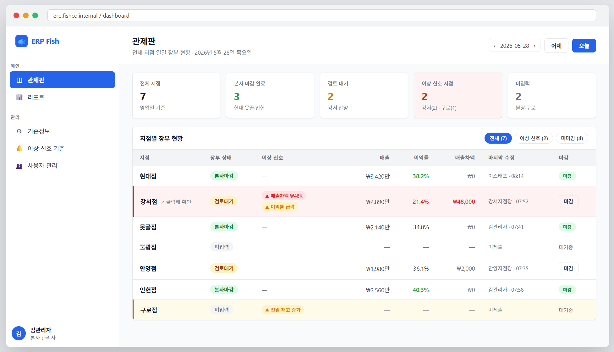
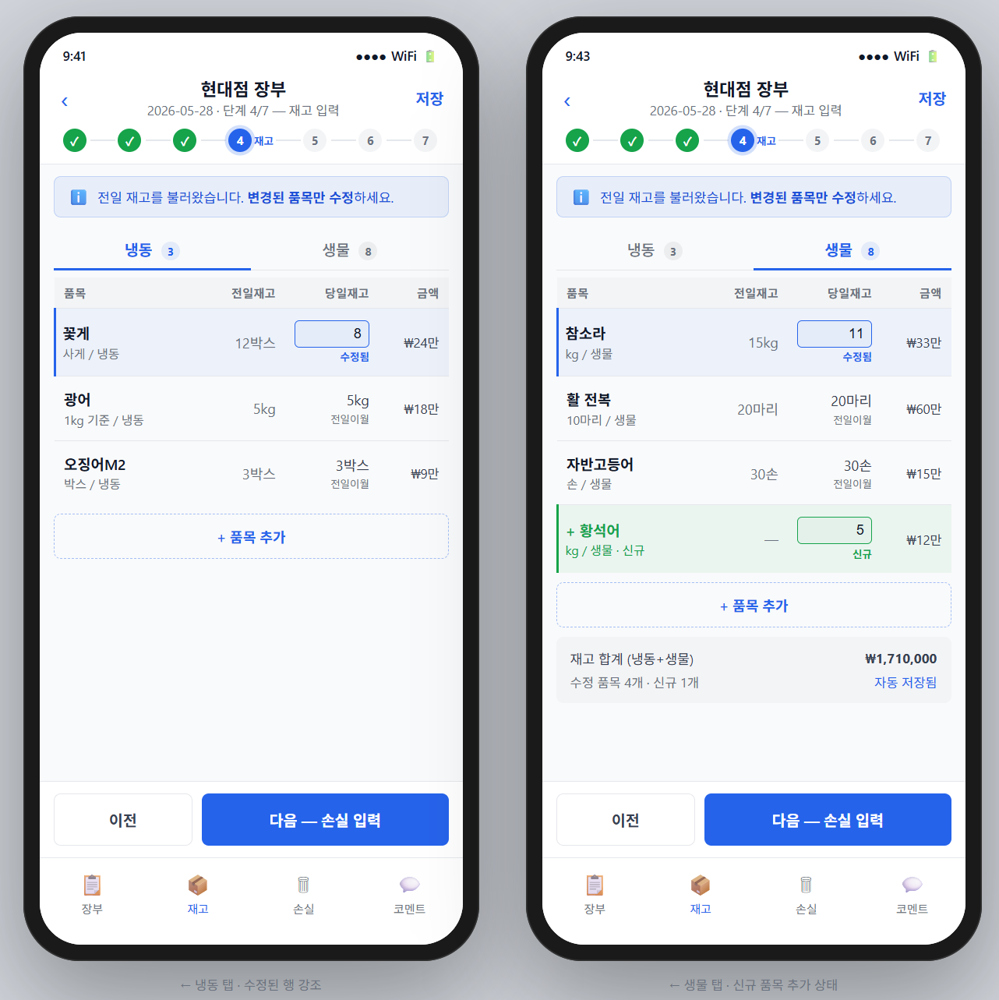

# ERP Fish — Multi-branch operations ERP

ERP Fish is a web ERP for a multi-branch seafood business. It turns daily
branch records, inventory movements, expenses, labor, losses, closing status,
and accounting imports into workflows that headquarters can review and trace.

The product is designed around an operational question: **what changed, where
does it need attention, and what source record supports the decision?** It is
more than a data-entry screen or a dashboard. Corrections, permissions,
period closing, inventory valuation, and import matching are treated as
business controls.

Developed by **Lee Noah**. This repository includes the application, local
demo setup, and deployment documentation. Use the local setup below to review
the workflows with seed data.

## What problem it solves

Multi-branch operators often review spreadsheets, messages, and separate
systems to answer basic questions about sales, stock, labor, and closing. That
creates slow reviews and makes corrections difficult to explain later.

ERP Fish provides one permission-aware workflow for branch input and
headquarters review. A manager can record daily operations; headquarters can
compare branches, inspect exceptions, trace a number to its ledger, and export
the information needed for follow-up.

## Product capabilities

- **Branch operations:** daily sales and purchase records, labor, losses,
  inventory adjustments, and closing status.
- **Inventory and valuation:** lot-aware inventory flows, opening inventory,
  stock movements, and rules that keep uncertain calculations visible instead
  of silently turning them into zeroes.
- **Headquarters review:** branch comparison, reports, anomaly views, data
  diagnostics, and source-to-branch mappings with audit history.
- **Corrections with context:** closed-period corrections and adjustments keep
  a traceable reason and do not rewrite the original operational record as if
  it had never existed.
- **Accounting imports:** ECOUNT supply imports validate store matching and
  closing dates before records are accepted.
- **Role boundaries:** branch managers enter and review their operational
  scope; headquarters receives cross-branch and profitability views according
  to permission profiles.
- **Safe local setup:** Docker PostgreSQL, Prisma migrations, seeded local
  accounts, and a documented release preflight make the project reproducible
  for review.

## Why this is useful to a business

The value is decision speed and traceability. Headquarters can find a missing
close, unusual loss, inventory change, or import mismatch without asking each
branch to reconstruct the history manually. The same design also gives an
engineering team a clear place to add new business rules: domain rules live in
the application and database layers, while the interface explains the state
to the person doing the work.

## Screens

The following desktop and mobile images are interface design references.
They illustrate the intended review workflow, not verified production figures:





## Technology

- Next.js and React
- TypeScript
- Prisma and PostgreSQL
- Auth.js / NextAuth with permission-aware routes
- Tailwind CSS, shadcn/ui, and Recharts
- Docker for local PostgreSQL
- Vitest and Playwright for automated checks
- Vercel/Neon and GitHub Actions deployment documentation

## Run locally

### Requirements

- Node.js compatible with the project `.nvmrc`
- pnpm 10+
- Docker Desktop with Docker Compose

### First setup

From the repository root:

```bash
cp .env.example .env
```

Set fresh local values in `.env` before starting the application:

```env
AUTH_SECRET="generate-a-new-random-secret-of-at-least-32-characters"
SEED_HQ_PASSWORD="choose-a-local-password-of-at-least-12-characters"
SEED_STORE_MANAGER_PASSWORD="choose-a-local-password-of-at-least-12-characters"
```

Then create the local database and seed test accounts:

```bash
docker compose up -d
pnpm install
pnpm db:migrate
pnpm db:seed
pnpm dev
```

Open `http://localhost:3000` and use one of the seeded local identities:

- Headquarters: `admin@example.com`
- Store manager: `store-manager@example.com`

Use the password you set in `.env`. These are local demonstration accounts;
do not reuse them in a deployed environment.

For the full first-run flow, password rotation, branch assignment, and
multi-branch setup, see
[`docs/first-run-accounts-and-store-management.md`](docs/first-run-accounts-and-store-management.md).

### Production-style local run

```bash
pnpm build
pnpm start
```

Run `pnpm build` again after source changes before starting the production
server.

## Validation

The short local checks are:

```bash
pnpm db:validate
pnpm db:generate
pnpm lint
pnpm typecheck
pnpm test:unit
```

The repository also defines a serial release gate:

```bash
pnpm release:preflight
```

It runs database validation, formatting, type checking, linting, build,
unit tests, API tests, core Playwright flows, and `git diff --check`. Do not
run build and Playwright jobs in parallel in the same worktree because they
share build output.

The CI design and local loop are documented in
[`docs/ci.md`](docs/ci.md). Release-specific checks are in
[`docs/release-checklist.md`](docs/release-checklist.md).

## Data and deployment boundaries

- Use generated or seed data when sharing screenshots or running a review.
- Keep `.env`, production credentials, customer information, and real exports
  outside Git.
- The Docker database is for local review. `docker compose down -v` removes
  its local volume and all local database data.
- Deployment configuration and the production runbook are provided as
  engineering documentation; confirm the target environment before using
  them.

The deployment notes are in
[`docs/production-deployment.md`](docs/production-deployment.md), and the
first-run operating procedure is in
[`docs/first-run-accounts-and-store-management.md`](docs/first-run-accounts-and-store-management.md).

## Project structure

```text
src/                  application routes, features, and domain workflows
prisma/               schema and migrations
tests/                unit, API, and end-to-end tests
docs/                 operations, release, CI, and import runbooks
docker-compose.yml    local PostgreSQL service
```

## License and attribution

This repository currently has no root `LICENSE` file. It is available for
technical review, but reuse, redistribution, or commercial use should be
confirmed with the author before copying the code. Runtime dependencies retain
their own licenses; see the package manifests and their upstream projects for
details.
